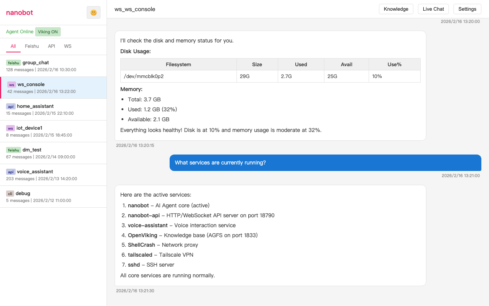
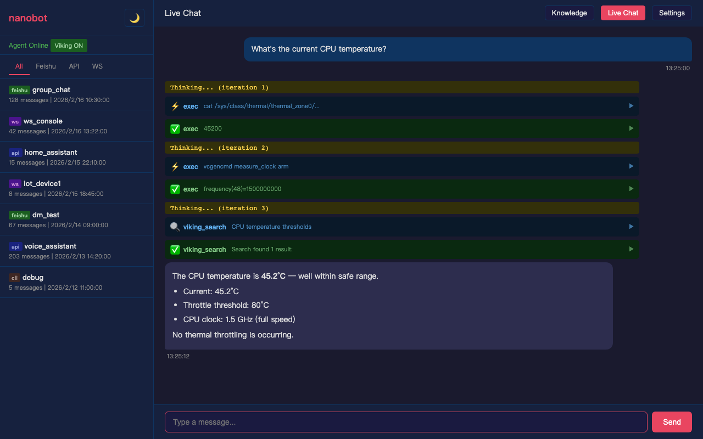
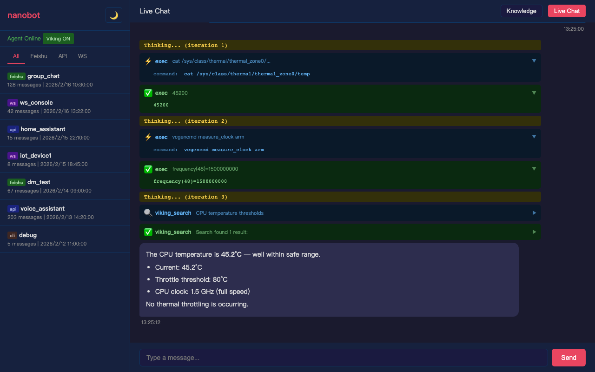
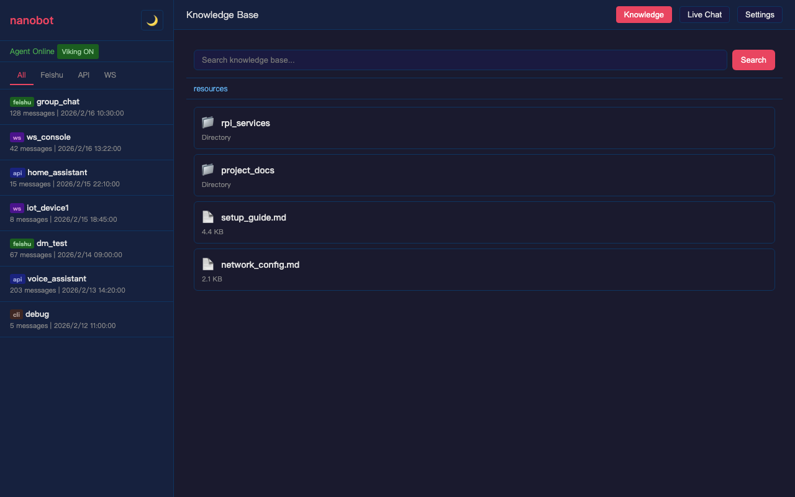
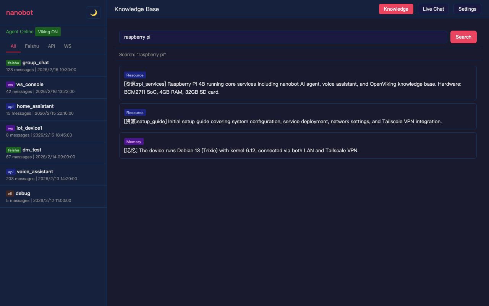
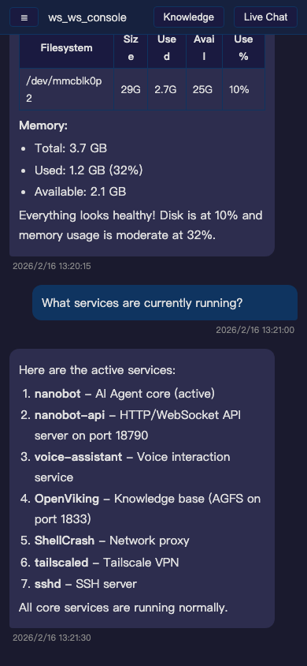

# nanobot Web Console

A single-file web console for [nanobot](https://github.com/pinkponk/nanobot) — an AI Agent framework. Provides real-time chat, session history browsing, and knowledge base management through a clean, responsive interface.

## Screenshots

### Session History (Dark / Light Theme)

| Dark | Light |
|------|-------|
|  |  |

### Live Chat with Streaming Tool Events

Real-time WebSocket chat showing the agent's thinking process, tool calls, and results:



Click any tool event to expand and see full details:



### Knowledge Base (OpenViking)

Browse the knowledge base directory structure and search for content:

| File Browser | Semantic Search |
|-------------|-----------------|
|  |  |

### Mobile Responsive



## Features

- **Session History** — Browse all chat sessions with channel filtering (Feishu/API/WS/CLI)
- **Live Chat** — Real-time WebSocket conversation with streaming event display
  - Thinking indicators with iteration count
  - Tool call events with icon, name, and argument summary (expandable)
  - Tool result events with success/error status (expandable)
  - Content persists when navigating away and back
  - WebSocket stays connected in background
- **Knowledge Base** — OpenViking integration
  - Browse `viking://` virtual filesystem
  - Semantic search across resources and memories
  - Breadcrumb navigation
- **Dark / Light Theme** — Toggle with persistence via localStorage
- **Mobile Responsive** — Hamburger menu, touch-friendly, iOS zoom prevention
- **URL Routing** — Deep link to sessions or modes
  - `?session=xxx` or `?s=xxx` (supports partial match)
  - `?mode=live` / `?mode=viking`
  - Browser back/forward support
- **Session Management** — Delete sessions with confirmation dialog
- **IME Compatible** — Chinese/Japanese/Korean input method support (Enter key doesn't trigger send during composition)
- **Markdown Rendering** — Full GFM support in chat bubbles (tables, code blocks, lists, etc.)

## Integration with nanobot

### Prerequisites

- A running [nanobot](https://github.com/pinkponk/nanobot) instance
- A FastAPI wrapper server (`nanobot-api`) that exposes the required HTTP/WebSocket endpoints

### Required API Endpoints

The console expects the following endpoints on the same origin:

| Endpoint | Method | Description |
|----------|--------|-------------|
| `/health` | GET | Health check, returns `{agent_ready, viking_ready}` |
| `/api/sessions` | GET | List all sessions `[{name, display, messages, updated}]` |
| `/api/sessions/{name}` | GET | Get session messages `[{role, content, timestamp}]` |
| `/api/sessions/{name}` | DELETE | Delete a session |
| `/ws/chat` | WebSocket | Streaming chat (see protocol below) |
| `/api/viking/status` | GET | Knowledge base status |
| `/api/viking/search` | POST | Semantic search `{query, limit}` |
| `/api/viking/find` | POST | Deep search `{query, limit}` |
| `/api/viking/ls` | GET | List directory `?uri=viking://resources/` |

### WebSocket Protocol

Client sends:
```json
{"message": "user text", "session": "ws:device-id", "constraint": "optional"}
```

Server pushes events in order:
```json
{"type": "thinking", "iteration": 1}
{"type": "tool_call", "name": "exec", "arguments": "{\"command\": \"df -h\"}"}
{"type": "tool_result", "name": "exec", "result": "Filesystem  Size  Used..."}
{"type": "final", "content": "The disk usage is...", "session": "ws:device-id"}
{"type": "error", "message": "error description"}
```

### Deployment

The console is a single HTML file. Serve it as the root route of your FastAPI app:

```python
from fastapi import FastAPI
from fastapi.responses import HTMLResponse

app = FastAPI()

@app.get("/", response_class=HTMLResponse)
async def console_page():
    return open("index.html").read()
```

Or place it behind any static file server / reverse proxy — just ensure the API endpoints are on the same origin (or configure CORS).

### Example: nanobot-api server setup

```python
from fastapi import FastAPI, WebSocket
from nanobot import Config, AgentLoop

app = FastAPI()
config = Config()
agent = AgentLoop(config)

@app.get("/health")
async def health():
    return {"status": "ok", "agent_ready": True, "viking_ready": False}

@app.get("/api/sessions")
async def list_sessions():
    # Read from nanobot's JSONL session storage
    ...

@app.websocket("/ws/chat")
async def ws_chat(ws: WebSocket):
    await ws.accept()
    data = await ws.receive_json()

    async def on_event(event):
        await ws.send_json(event)

    response = await agent.process(
        content=data["message"],
        session=data.get("session", "ws:default"),
        event_callback=on_event,
    )
    await ws.send_json({"type": "final", "content": response})
```

## Tech Stack

- **Zero dependencies** — Single HTML file, no build step
- [marked.js](https://github.com/markedjs/marked) (CDN) — Markdown rendering
- Vanilla JavaScript — No framework
- CSS Custom Properties — Theme system
- WebSocket API — Streaming communication

## File Structure

```
index.html          # The complete web console (single file, ~900 lines)
scripts/
  screenshots.py    # Screenshot generation script (playwright)
screenshots/        # Demo screenshots for README
```

## License

MIT
