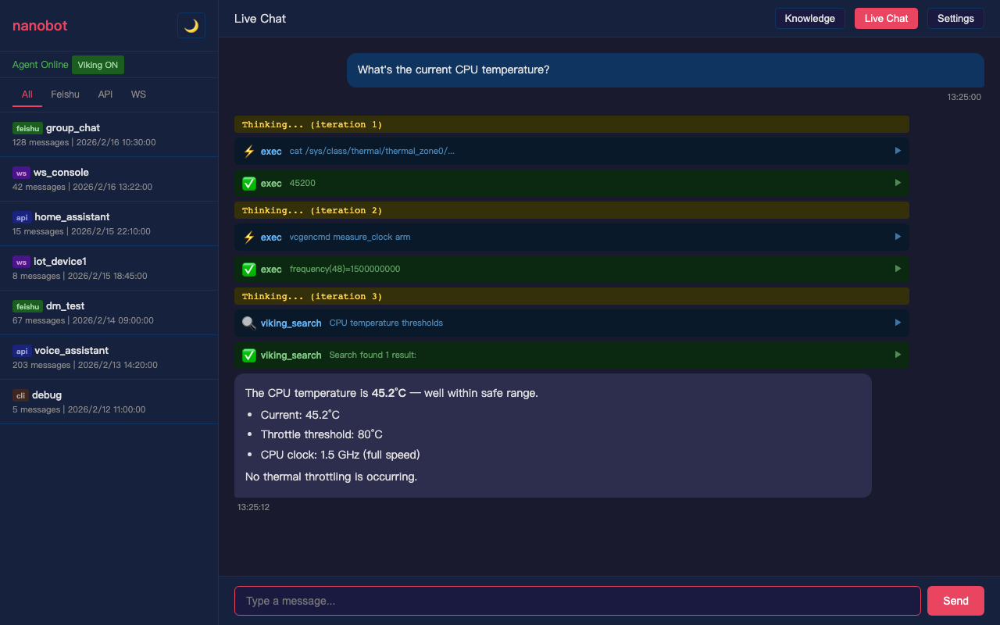
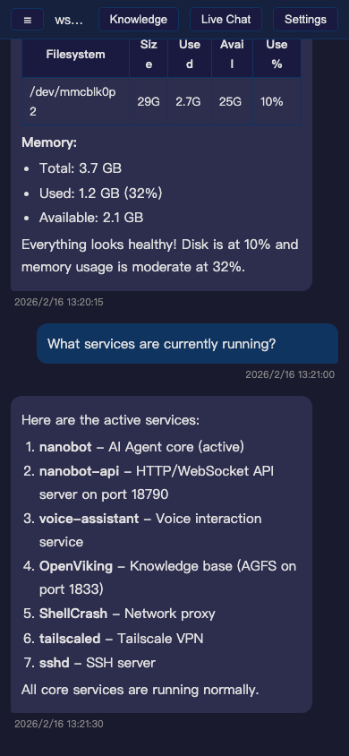
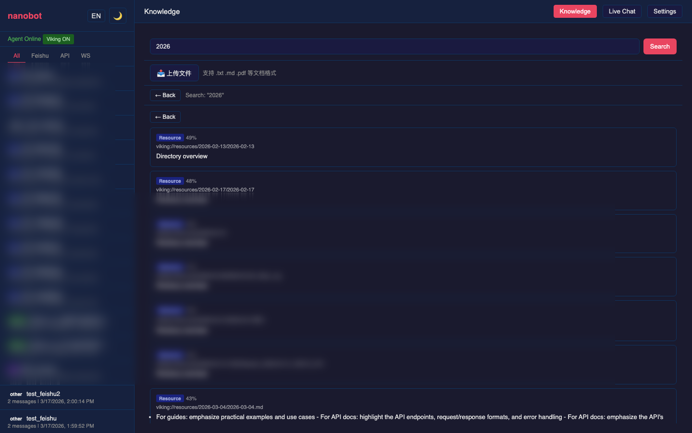
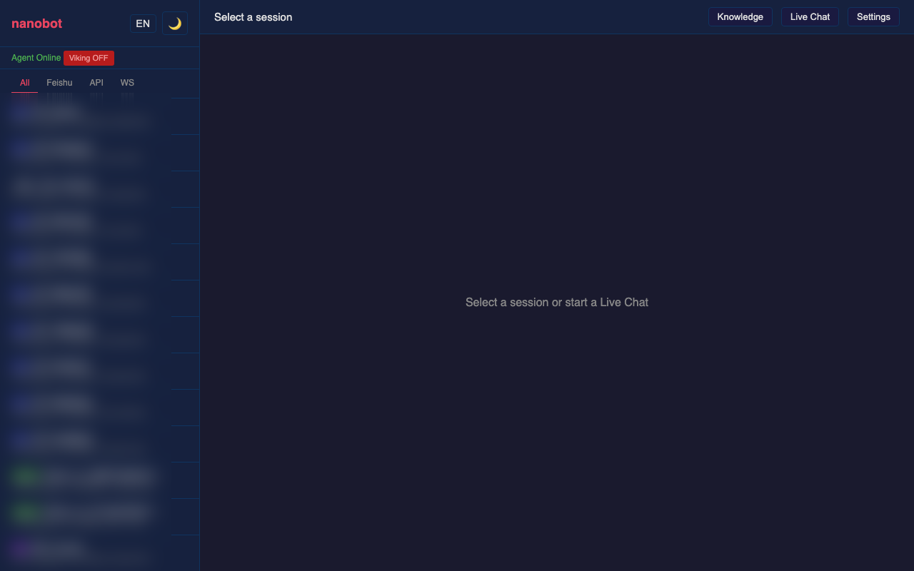

# nanobot Web Console

**[English](README.md) | [中文](README_CN.md)**

A web console + API server for [nanobot](https://github.com/HKUDS/nanobot) — an ultra-lightweight personal AI assistant framework.

nanobot provides a powerful agent core (tools, skills, memory, channels) but no HTTP API or web UI. This project adds both: a FastAPI server and a single-file web console.

## Screenshots

| Session History | Live Chat |
|----------------|-----------|
|  |  |

| Settings | Mobile |
|----------|--------|
|  |  |

| Knowledge Base | Semantic Search |
|---------------|----------------|
|  |  |

| File Viewer | Onboarding |
|------------|-----------|
|  |  |

## Quick Start

**Prerequisites:** Python 3.11+, [nanobot](https://github.com/HKUDS/nanobot) installed and configured (`~/.nanobot/config.json`)

### Install via pip

```bash
pip install nanobot-ai         # install nanobot first
pip install nanobot-web-console
nanobot-console
```

Open `http://localhost:18790`.

### Install from source

```bash
pip install nanobot-ai
git clone https://github.com/tankyhsu/nanobot-web-console.git
cd nanobot-web-console
pip install .
nanobot-console
```

### CLI options

```
nanobot-console              # default: 0.0.0.0:18790
nanobot-console --port 8080  # custom port
nanobot-console --host 127.0.0.1  # bind to localhost only
nanobot-console --reload     # auto-reload for development
nanobot-console --version    # show version
```

You can also run as a Python module:

```bash
python -m nanobot_web_console --port 8080
```

### Run as systemd service (Linux)

```ini
# /etc/systemd/system/nanobot-api.service
[Unit]
Description=nanobot API Server
After=network-online.target

[Service]
Type=simple
ExecStart=/usr/local/bin/nanobot-console
Environment=HOME=/root
Restart=always
RestartSec=5

[Install]
WantedBy=multi-user.target
```

```bash
systemctl enable --now nanobot-api
```

## Features

### Web Console

- **Session History** — Browse all sessions with channel filtering (Feishu / API / WS / CLI). Tool call and result messages render as collapsible cards.
- **Live Chat** — Real-time WebSocket chat with streaming thinking indicators, tool call events, and results. Content persists when navigating away.
- **Settings** — 6-tab configuration panel:
  - **Agent** — Model, temperature, max tokens, iterations, context window tokens
  - **Channels** — `sendProgress` / `sendToolHints` toggles
  - **Providers** — Edit API keys and base URLs per provider
  - **Cron** — Manage nanobot scheduled jobs (add / toggle / trigger / delete) and system crontab
  - **Prompts** — Edit SOUL.md, AGENTS.md, USER.md in-browser
  - **Info** — Tools, skills, memory viewer
- **Knowledge Base** *(optional, `pip install openviking` to enable)* — Browse `viking://` filesystem, view file contents, upload/delete files, semantic search; shows install guide when not installed
- **Dark / Light theme**, mobile responsive, URL routing, IME-compatible input

### API Server

- `POST /api/chat` — Simple chat with emotion detection
- `POST /v1/chat/completions` — OpenAI-compatible endpoint
- `WS /ws/chat` — Streaming chat (thinking / tool_call / tool_result / final events + 15s heartbeat)
- `GET/DELETE /api/sessions/{name}` — Session management
- `GET/POST /api/config` — View and update agent config
- `GET/POST /api/cron/jobs` — Nanobot cron job management
- `/api/viking/*` — Knowledge base *(optional, requires `pip install openviking`)*

## WebSocket Protocol

Client sends:
```json
{"message": "user text", "session": "ws:device-id", "constraint": "optional"}
```

Server pushes:
```json
{"type": "thinking", "content": "..."}
{"type": "stream", "delta": "..."}
{"type": "stream_end", "resuming": false}
{"type": "tool_call", "content": "..."}
{"type": "heartbeat", "timestamp": 1739800015.0}
{"type": "final", "content": "...", "emotion": "happy", "session": "ws:device-id"}
```

## Knowledge Base (Optional)

One command to enable:

```bash
pip install openviking
```

Restart `nanobot-console` — it auto-detects and initializes. When not installed, the server runs normally and shows an install guide in the Knowledge Base tab.

### Knowledge Base Features

- **File Browser** — Navigate the `viking://` virtual filesystem with directory support
- **File Viewer** — Built-in Markdown renderer to read knowledge base files in-browser
- **File Upload** — Drag-and-drop or click to upload multiple files; auto-indexed for semantic search
- **File Delete** — Confirmation dialog + error feedback
- **Semantic Search** — Full-text semantic search across all resources
- **Live Chat KB Toggle** — Button next to the input field to enable/disable RAG augmentation per message

## File Structure

```
nanobot_web_console/
  __init__.py    # Package version
  cli.py         # CLI entry point (nanobot-console command)
  server.py      # FastAPI server
  index.html     # Web console (single file, zero dependencies)
pyproject.toml   # Package metadata
server.py        # Backward-compatible entry point
```

## Tech Stack

- **Backend** — FastAPI + Uvicorn, imports nanobot internals directly
- **Frontend** — Vanilla JS, CSS custom properties, WebSocket API, [marked.js](https://github.com/markedjs/marked) (CDN)

## License

MIT
