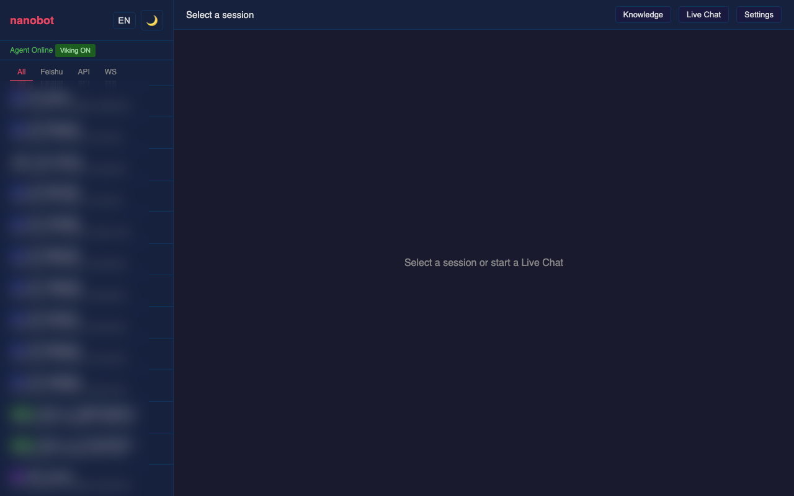
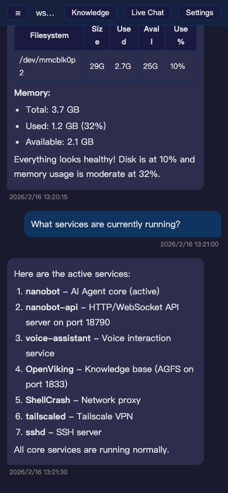

# nanobot Web Console

**[English](README.md) | [中文](README_CN.md)**

为 [nanobot](https://github.com/HKUDS/nanobot) 打造的 Web 控制台 + API 服务。nanobot 是一个超轻量的个人 AI Agent 框架，但它本身只提供 CLI 和渠道交互（飞书、Telegram 等），**没有 HTTP API，也没有 Web 界面**。

本项目补齐了这块：一个 FastAPI 服务（`server.py`）+ 一个单文件 Web 控制台（`index.html`），提供：

- 浏览器实时对话，流式展示工具调用过程
- HTTP API 和 OpenAI 兼容接口，方便外部集成
- 跨渠道会话历史浏览
- Agent 配置管理（模型、工具、技能、提示词）
- 可选的知识库集成（[nanobot-viking](https://github.com/tankyhsu/nanobot-viking)）

## 截图

### 会话历史（深色 / 浅色主题）

| 深色 | 浅色 |
|------|------|
|  |  |

### 实时对话（工具调用流式展示）

WebSocket 实时对话，展示 Agent 的思考过程、工具调用和执行结果：


点击工具事件卡片可展开查看完整细节：


### 设置面板

查看和编辑模型配置，浏览已注册的工具和技能，编辑系统提示词：



### 知识库浏览器（OpenViking）— 可选

需要 [nanobot-viking](https://github.com/tankyhsu/nanobot-viking)：

| 文件浏览 | 语义搜索 |
|----------|----------|
|  |  |

### 移动端适配



## 架构

```
┌─────────────────────────────────────────────────────┐
│                 server.py (FastAPI)                   │
│                                                       │
│  GET  /              ──→ 提供 index.html (控制台)     │
│  GET  /health        ──→ 健康检查                     │
│  GET  /api/sessions  ──→ 列出所有会话 (JSONL)         │
│  POST /api/chat      ──→ 简单对话（带情绪检测）        │
│  POST /v1/chat/completions ──→ OpenAI 兼容 API       │
│  WS   /ws/chat       ──→ 流式对话 + 事件推送          │
│  GET  /api/config    ──→ 模型、工具、技能、提示词      │
│  POST /api/config    ──→ 更新模型配置                  │
│  /api/viking/*       ──→ 知识库（可选）               │
│                                                       │
│  导入 nanobot 内部模块:                                │
│    AgentLoop, MessageBus, SessionManager              │
│    load_config, CronService                           │
│    VikingService（可选）                               │
└─────────────────────────────────────────────────────┘
```

`server.py` 是 nanobot Python 内部和 Web 之间的桥梁。启动时初始化 nanobot 的 `AgentLoop`、`MessageBus`、`SessionManager`、`CronService`，然后暴露为 HTTP/WebSocket 接口。Web 控制台（`index.html`）通过这些接口交互。

## 快速开始

### 前置要求

- Python 3.11+
- [nanobot](https://github.com/HKUDS/nanobot) 已安装并配置好（`~/.nanobot/config.json`）

```bash
pip install nanobot-ai
```

### 1. 克隆项目

```bash
git clone https://github.com/tankyhsu/nanobot-web-console.git
cd nanobot-web-console
```

### 2. 安装依赖

```bash
pip install fastapi uvicorn pydantic
```

### 3. 运行

```bash
python server.py
```

浏览器打开 `http://localhost:18790`。

### 4. 注册为系统服务（可选）

```ini
# /etc/systemd/system/nanobot-api.service
[Unit]
Description=nanobot API Server
After=network-online.target

[Service]
Type=simple
ExecStart=/usr/bin/python3 /path/to/server.py
WorkingDirectory=/path/to/nanobot-web-console
Environment=HOME=/root
Restart=always
RestartSec=5

[Install]
WantedBy=multi-user.target
```

```bash
systemctl enable --now nanobot-api
```

## 与 nanobot 的关系

### nanobot 提供什么（以及不提供什么）

[nanobot](https://github.com/HKUDS/nanobot) 是一个 ~4000 行的 AI Agent 框架，提供：

- `AgentLoop` — LLM 推理循环 + 工具执行
- `MessageBus` — 内部消息路由
- `SessionManager` — JSONL 格式会话持久化
- `CronService` — 定时任务
- 渠道 — 飞书、Telegram、Discord、Slack、QQ、邮件等
- 工具 — exec、read_file、write_file、web_search 等
- 技能 — 自定义自动化脚本
- 记忆 — 长期记忆系统

nanobot **不提供**的：
- 没有 HTTP API 服务
- 没有 Web UI
- 没有 WebSocket 流式接口
- 没有 OpenAI 兼容端点

本项目补齐了这些。

### server.py 做了什么

`server.py` 导入 nanobot 的内部模块，用 FastAPI 封装：

```python
from nanobot.config.loader import load_config
from nanobot.agent.loop import AgentLoop
from nanobot.bus.queue import MessageBus
from nanobot.session.manager import SessionManager
from nanobot.cron.service import CronService
```

启动时（`lifespan`）：
1. 加载 nanobot 配置（`~/.nanobot/config.json`）
2. 创建 LLM provider（通过 `LiteLLMProvider`）
3. 初始化 `AgentLoop`（含所有工具和设置）
4. 可选启动 `VikingService`（知识库）
5. 启动 `CronService`（定时任务）

### nanobot config.json 结构

`server.py` 读取标准的 nanobot 配置 `~/.nanobot/config.json`：

```json
{
  "agents": {
    "defaults": {
      "workspace": "~/.nanobot/workspace",
      "model": "openai/your-model-name",
      "maxTokens": 8192,
      "temperature": 0.7,
      "maxToolIterations": 50
    }
  },
  "providers": {
    "openai": {
      "apiKey": "your-api-key",
      "apiBase": "https://api.example.com/v1"
    }
  },
  "tools": {
    "web": { "search": { "apiKey": "brave-api-key", "maxResults": 5 } },
    "exec": { "timeout": 60 }
  }
}
```

不需要额外配置，`server.py` 复用 nanobot 的全部配置。

## 功能特性

### Web 控制台 (index.html)

- **会话历史** — 浏览所有对话记录，按渠道筛选（飞书/API/WS/CLI）
- **实时对话** — WebSocket 流式对话
  - 思考状态指示（含迭代次数）
  - 工具调用事件卡片（可展开查看参数和结果）
  - 切换页面时对话内容不丢失
- **设置面板** — 查看和管理 Agent 配置
  - 模型设置（模型名、温度、max tokens、最大迭代）
  - 已注册工具列表及参数说明
  - 技能列表（可展开详情）
  - 系统提示词编辑器（SOUL.md、AGENTS.md、USER.md）
  - 长期记忆查看
- **知识库** *（可选，需 [nanobot-viking](https://github.com/tankyhsu/nanobot-viking)）*
  - 浏览 `viking://` 虚拟文件系统
  - 跨资源和记忆的语义搜索
- **深色 / 浅色主题**
- **移动端适配**
- **URL 路由** — `?session=xxx`、`?mode=live`、`?mode=viking`、`?mode=settings`
- **输入法兼容** — 中日韩输入法回车不误触发

### API 服务 (server.py)

- **简单对话** — `POST /api/chat`，带情绪检测
- **OpenAI 兼容** — `POST /v1/chat/completions`，方便接入期望 OpenAI API 的工具
- **WebSocket 流式** — `WS /ws/chat`，推送 thinking、tool_call、tool_result、final 事件
- **会话管理** — REST API 列出、查看、删除会话
- **配置 API** — 查看/更新模型设置，浏览工具和技能
- **RAG 增强** — 自动用知识库上下文丰富用户消息（Viking 可用时）
- **主动记忆** — 每次对话自动记录到 `HISTORY.md` 实现跨会话回忆，每 10 次对话由 LLM 自动整合 `MEMORY.md` 长期记忆
- **WebSocket 心跳** — Agent 处理期间每 15 秒发送心跳，防止客户端超时断连
- **情绪检测** — 基于关键词的情绪标注，适配 TTS/表情头像
- **TTS 友好输出** — 自动去除 Markdown 格式，适合语音朗读

## API 参考

### HTTP 端点

| 端点 | 方法 | 说明 |
|------|------|------|
| `/` | GET | Web 控制台 |
| `/health` | GET | `{status, agent_ready, viking_ready}` |
| `/api/sessions` | GET | 列出所有会话 |
| `/api/sessions/{name}` | GET | 获取会话消息 |
| `/api/sessions/{name}` | DELETE | 删除会话 |
| `/api/chat` | POST | 简单对话（带情绪） |
| `/v1/chat/completions` | POST | OpenAI 兼容对话 |
| `/v1/models` | GET | 列出可用模型 |
| `/api/config` | GET | Agent 配置（模型、工具、技能、提示词、记忆） |
| `/api/config` | POST | 更新模型配置 |
| `/api/config/prompt` | POST | 更新系统提示词文件 |
| `/api/viking/*` | * | 知识库 *（可选）* |

### WebSocket 协议 (`/ws/chat`)

客户端发送：
```json
{"message": "用户消息", "session": "ws:device-id", "constraint": "可选约束"}
```

服务端推送事件：
```json
{"type": "thinking", "iteration": 1, "emotion": "thinking"}
{"type": "tool_call", "name": "exec", "arguments": "{\"command\": \"df -h\"}", "emotion": "gear"}
{"type": "tool_result", "name": "exec", "result": "...", "emotion": "cool"}
{"type": "heartbeat", "timestamp": 1739800015.0}
{"type": "final", "content": "...", "emotion": "happy", "session": "ws:device-id"}
```

`heartbeat` 事件在 Agent 处理期间每 15 秒发送一次，防止客户端因工具执行耗时过长而判定超时。

### 简单对话 (`POST /api/chat`)

```bash
curl -X POST http://localhost:18790/api/chat \
  -H "Content-Type: application/json" \
  -d '{"message": "正在运行哪些服务？", "session": "api:test"}'
```

## 可选：知识库集成

需要 RAG（检索增强生成），添加 [nanobot-viking](https://github.com/tankyhsu/nanobot-viking)：

```bash
# 把 viking_service.py 复制到 server.py 同目录
cp /path/to/nanobot-viking/viking_service.py .
```

`server.py` 启动时会自动检测并初始化 `VikingService`。Viking 不可用时服务正常运行，只是没有知识库功能。

## 文件结构

```
server.py           # FastAPI 服务 — nanobot 与 Web 之间的桥梁
index.html          # Web 控制台（单文件，零依赖）
scripts/
  screenshots.py    # 截图生成脚本（playwright，用于 README）
screenshots/        # 示例截图
```

## 技术栈

- **server.py** — FastAPI + Uvicorn，直接导入 nanobot 内部模块
- **index.html** — 单 HTML 文件，无构建步骤，无 npm
  - [marked.js](https://github.com/markedjs/marked)（CDN）Markdown 渲染
  - 原生 JavaScript，CSS 自定义属性实现主题
  - WebSocket API 实现流式通信

## SiliconFlow 免费模型

如果您使用 [SiliconFlow（硅基流动）](https://siliconflow.cn) 作为 LLM 服务商，Viking 知识库集成使用的向量模型（`BAAI/bge-m3`）和视觉模型（`DeepSeek-OCR`）均可在**免费额度**内使用。

通过推荐链接注册可获得额外赠送额度：**https://cloud.siliconflow.cn/i/UzI0F3Xv**


## 更新日志

### v0.4.0

- **适配 nanobot 0.1.4.post2** — 更新 `StreamingAgentLoop._run_agent_loop` 返回三元组 `(final_content, tools_used, messages)`，匹配上游新签名。
- **移除自定义记忆机制** — 删除 `server.py` 中的 `_store_memory` / `_consolidate_long_term_memory`。nanobot 0.1.4.post2 内置的记忆整合（每 50 条消息自动触发，或 `/new` 手动触发）已完全覆盖此功能。

### v0.3.0

- **适配 nanobot 0.1.4.post1** — 适配 MessageBus API 变更（`consume_outbound` 替代 `subscribe_outbound`/`dispatch_outbound`）。`StreamingAgentLoop` 覆写 `_run_agent_loop` 实现 WebSocket 实时推送。
- **主动记忆系统** — 每次对话自动追加到 `HISTORY.md` 实现跨会话回忆。每 10 次对话由 LLM 整合历史到 `MEMORY.md` 长期记忆。
- **WebSocket 心跳** — Agent 处理期间每 15 秒发送心跳，防止客户端因工具执行耗时过长而超时断连。
- **Session 路径修复** — 适配 nanobot 0.1.4 新的 session 存储位置（`workspace/sessions/`），同时兼容旧路径 `~/.nanobot/sessions/`。

### v0.2.0

- **适配 nanobot 0.1.4** — `StreamingAgentLoop` 通过覆写 `_run_agent_loop` 实现 WebSocket 实时推送 thinking、tool_call、tool_result 事件。支持新参数：`temperature`、`max_tokens`、`mcp_servers`。
- **WebSocket 断线自动重连** — 实时对话中连接断开后指数退避重连（1s→30s）。
- **Viking 完全可选** — `viking_service.py` 导入改为 try/except，不部署 Viking 也能正常启动。

### v0.0.2

- **国际化支持** — 中英文一键切换，自动检测浏览器语言。所有 UI 文本均可翻译，语言偏好通过 localStorage 持久化。

### v0.0.1

- 首次发布：Web 控制台（`index.html`）+ API 服务（`server.py`）
- 会话历史浏览，按渠道筛选
- 实时对话，流式展示工具调用过程
- 设置面板（模型配置、工具、技能、提示词编辑器、记忆查看）
- 知识库浏览器和语义搜索（可选，需 nanobot-viking）
- 深色/浅色主题切换
- 移动端适配
- URL 路由和输入法兼容

## 许可证

MIT
